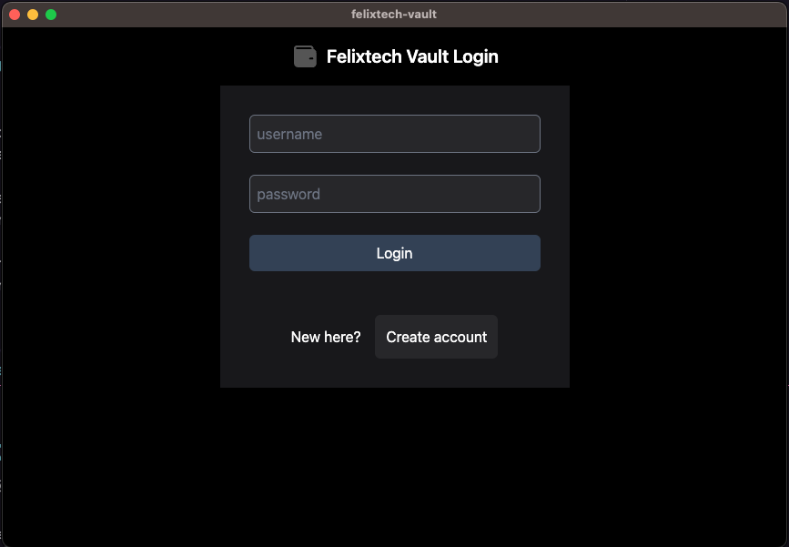
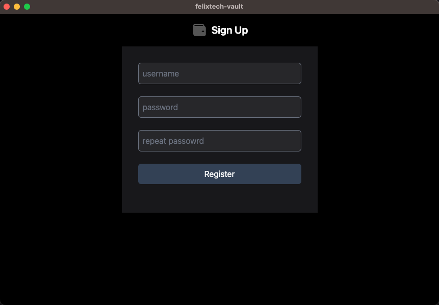
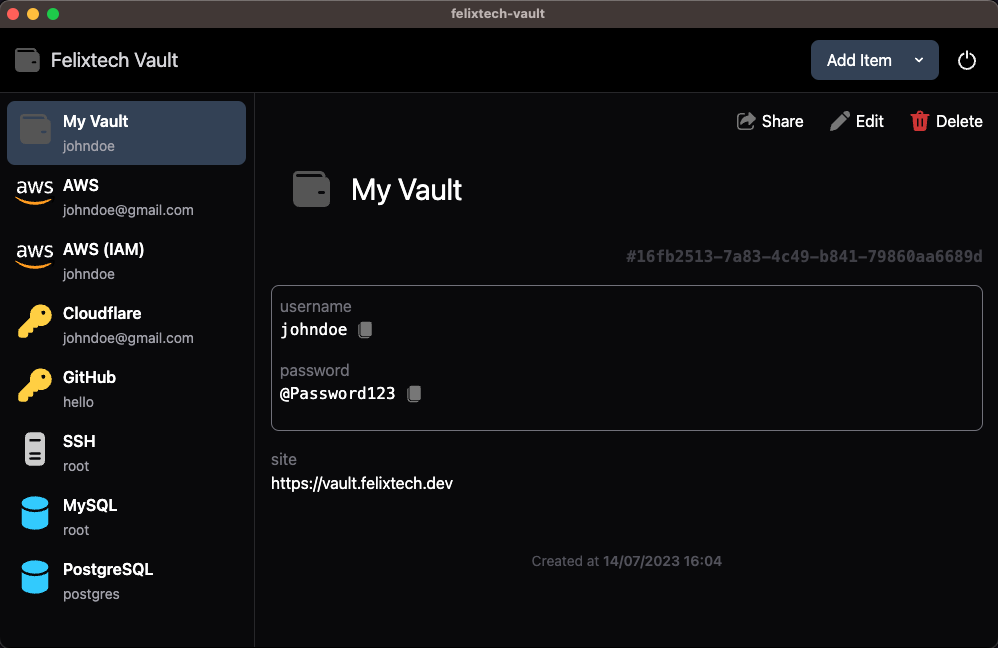

# Felixtech Vault App

<p align="center"></p>
<p align="center"></p>
<p align="center"></p>

## Usage

### Install Dependencies

```bash
npm ci
```

### Use it

```bash
# development mode
npm run dev

# production build
npm run build
```
